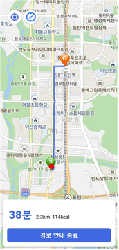
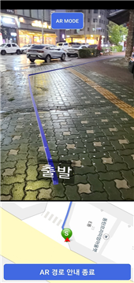

# 2024 BRIGHT MAKERS EXPO「제16회 캡스톤디자인 경진대회」
AR내비게이션

> **개발기간:2024.04 - 2024.11**

## 팀 구성
|팀원|소속|깃허브|
|:---:|:---:|:---:|
|송규림|한경대 컴퓨터공학과 SC|[@gyuliming](https://github.com/gyuliming)|
|조정행|한경대 컴퓨터공학과 SC|[@JOJeongHaeng](https://github.com/JOJeongHaeng)|

## 프로젝트 소개

본 프로젝트는 일반 도보 내비게이션과 AR 도보 내비게이션을 모두 제공하여 사용자가 상황에 맞게 두 가지 모드 중 하나를 선택할 수 있도록 설계되었다. 각 모드는 서로 보완적인 기능을 통해 도보 경로 안내의 편리함과 직관성을 극대화한다.

 일반 도보 내비게이션은 TMap API를 활용하여 기본적인 경로 안내 기능을 제공하며, 실시간 위치 추적과 나침반 기능을 통해 직관적인 경로 탐색을 지원한다.
 
● TMap API를 이용해 도보 경로 정보 추출 및 안내

● 사용자의 진행 방향에 따라 지도를 동적으로 회전할 수 있는 나침반 모드 제공  

● GPS를 통한 실시간 위치 추적
 
 AR 도보 내비게이션 모드는 증강현실(AR) 기술을 도입해 현실 공간에서 경로를 시각적으로 안내한다. 이 모드는 사용자가 스마트폰 화면을 통해 AR 객체를 활용한 경로 표시를 볼 수 있어, 지도와 현실 지형의 불일치로 인한 혼란을 최소화한다.
● TMap API에서 받아온 좌표에 Haversine Formula(두 점 사이의 대원 거리 공식)를 적용해서 AR 환경에서 경로를 시각적으로 안내하기 위한 3D 좌표로 변환
● ARCore 및 Sceneform을 이용해 카메라로 실제 환경을 받아와서 목적지까지의 AR 객체 배치 및 경로 안내

## 기술 스택 및 환경
- Java
- ARcore
- SceneForm
- VScode   

## 화면 구성 및 실행 화면 📺
| 일반 도보 내비게이션 | AR 내비게이션 |
| :-------------------------------------------: | :------------: |
|  |  |  

## 주요 기능

 초행길이나 복잡한 환경에서도 사용자가 경로를 쉽게 파악할 수 있으며, 카메라를 통해 항상 현재 위치를 알 수 있기에 위치 확인에 대한 번거로움을 줄일 수 있다는 것과, 
기존의 2D 지도 기반 경로 안내를 증강현실(AR) 기술로 확장하여 새로운 내비게이션 경험 제공해 현실과 디지털 정보를 자연스럽게 융합하여 사용자 혼란을 최소화하고 정확한 길 안내 제공한다는 것이 있다.
 본 프로젝트는 일반 지도 기반 도보 내비게이션의 효율성과 AR 기반 경로 안내의 직관성을 통합하여 사용자 중심의 내비게이션 솔루션을 제공한다. 이 결과물은 초행길이나 복잡한 환경에서의 길 찾기 문제를 효과적으로 해결할 수 있는 가능성을 제시한다.
